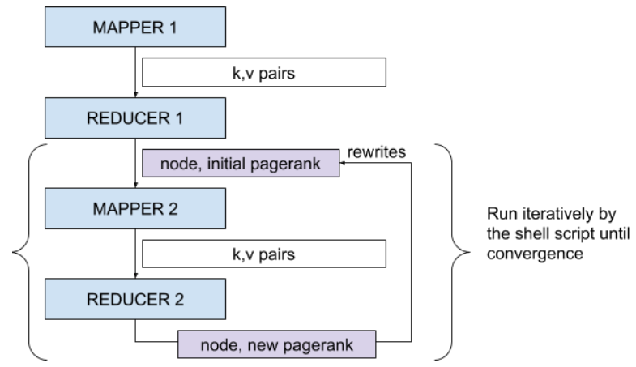

# Page Rank Algorithm
Implemented a Hadoop & MapReduce pipeline to the pagerank algorithm, automating webpage ranking calculation on 100GB dataset. Analyzed the impact of different alpha values, highlighting key changes & trends.

Page Rank Algorithm implementation with Map Reduce using Hadoop. This project involves implementation of the following 2 tasks:
1) To convert the input file to adjacency list using map reduce and store it in the HDFS.
2) To write mapper and reducer to calculate the page rank until convergence.

